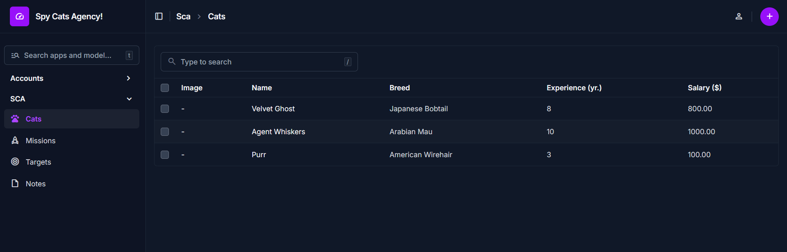
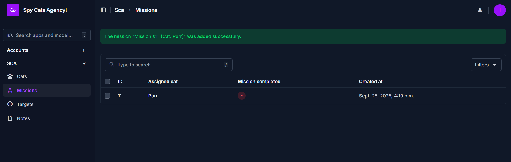
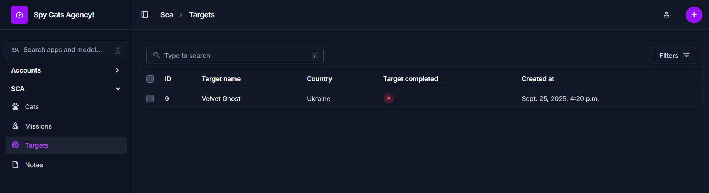
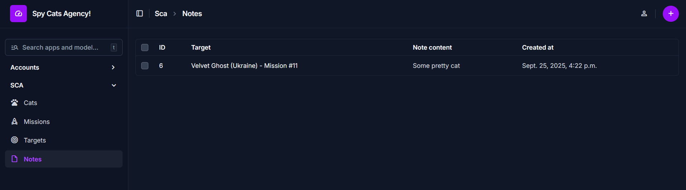
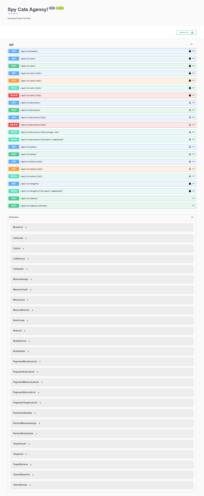

# Spy Cat Agency Backend

## Installation

Firstly, clone the repo

```bash
git clone https://github.com/CrazyProger1/DevelopersToday-SCA-backend.git
```

Then go to the folder

```bash
cd DevelopersToday-SCA-backend
```

Install the dependencies

```bash
uv sync

# OR

pip install requirements.txt
```

Create .env file from [sample](.env.sample)

```bash
cp .env.sample .env
```

Make migrations

```bash
uv run python manage.py migrate
```

Create superuser

```bash
uv run python manage.py createsuperuser
```

And finally, run the server!

```bash
uv run python manage.py runserver
```

## Usage

- Docs - http://localhost:8000/docs/
- Admin page - http://localhost:8000/admin/

> **Note:** instead of using postman, I've created swagger docs, you can find it [there](http://localhost:8000/docs/).

## Screenshots

<p align="center">

</p>

<p align="center">

</p>

<p align="center">

</p>

<p align="center">

</p>

<p align="center">

</p>

